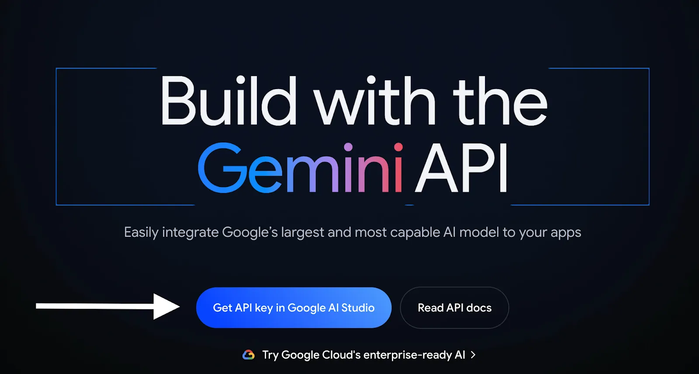

# Roadmap Genie 🧞‍♂✨

[](https://www.djangoproject.com/)
[](https://developer.mozilla.org/en-US/docs/Web/JavaScript)
[](LICENSE)

**AI-Powered Learning Roadmap Generator**  
Generate personalized learning paths with structured milestones and curated resources.

---

## 🖼️ Demo Screenshots

### 🔮 Landing Page


### 🚀 Sign Up Page


### 🔐 Login Page


---

## 🌟 Features

- **Smart Roadmap Generation**  
  Instantly creates learning paths for React, Python, and JavaScript.
- **Progress Tracking**  
  Visual progress bar with localStorage persistence.
- **Interactive Milestones**  
  Check off completed items with confetti celebrations 🎉.
- **Curated Resources**  
  Embedded videos, articles, and documentation links.
- **Responsive Design**  
  Works flawlessly on all devices.

---

## 🛠 Tech Stack

| Category       | Technologies Used                     |
|----------------|---------------------------------------|
| **Frontend**   | HTML5, CSS3, JavaScript (ES6+)        |
| **Backend**    | Django 3.2+                           |
| **UI/UX**      | Glassmorphism design, Font Awesome    |
| **Deployment** | 🚀 Coming Soon                        |

---

## 🚀 Getting Started

### Prerequisites
- Python 3.8+
- Django 3.2+
- Google Gemini API Integration

### Installation

```bash
# Clone repository
git clone https://github.com/kunalSingh026/Roadmap.git
cd roadmap-genie

# Set up virtual environment
python -m venv venv
source venv/bin/activate      # Linux/Mac
venv\Scripts\activate         # Windows

# Install dependencies
pip install -r requirements.txt

# Run Django server
python manage.py runserver


```

## 💡 Project Overview

**Roadmap Genie** is an **AI-powered web platform** that helps students generate personalized learning paths in domains like React, Python, and JavaScript. Instead of getting lost in random tutorials, students can simply enter a learning goal — and the platform builds a structured curriculum using AI/ML logic, user preferences, and real-time progress tracking.

---

## 🎯 Proposed Solution & Key Features

- **🎯 Goal-Based Roadmap Generation**  
  Students enter a goal (e.g. “Become a React Developer”) and their learning profile. AI generates a step-by-step roadmap.

- **🧠 AI/ML Personalization**  
  The platform adjusts the curriculum based on quiz performance, time spent, and progress. Learners get remediation or acceleration dynamically.

- **🌐 Content Aggregation via APIs**  
  Uses YouTube API and other educational APIs to fetch the best resources — videos, articles, and exercises.

- **🧩 Interactive Quizzes & Feedback**  
  Each module has quizzes with instant feedback. Scores update the roadmap to help students improve effectively.

- **📊 Dashboard & Analytics**  
  Tracks % completion, quiz scores, and topic-wise mastery using visual charts.

- **🔒 Authentication System**  
  Secure login/signup (via Django auth). User data is protected and persistent.

- **📱 Mobile-Responsive Design**  
  Fully responsive layout — perfect for tablets and smartphones.

- **⚡ Real-Time Processing (Optional)**  
  WebSocket-based updates. Quiz completions reflect on the dashboard instantly.

- **🌱 Sustainable & Scalable Architecture**  
  Uses Django + SQLite (upgradeable to PostgreSQL). Future-ready with Docker, cloud deployment, and green computing principles.

---

## 🧬 System Architecture

The platform is structured into **three main layers**:

1. **Frontend (HTML/CSS/JavaScript)**  
   - Handles login, goal input, roadmap display, progress dashboard  
   - Uses Chart.js or D3.js for data visualizations  

2. **Backend (Django + AI)**  
   - Processes user input  
   - Interacts with AI model (Gemini/OpenAI)  
   - Calls APIs (YouTube, quizzes)  
   - Stores roadmap data and analytics  

3. **Database (SQLite → PostgreSQL)**  
   - Stores user profiles, roadmap progress, and analytics  
   - Future upgrades will include better scalability via cloud-hosted databases  

---

## 🛠 Implementation Plan

- **Frontend**: Build all key screens — signup, goal input, roadmap, and dashboard  
- **Backend & DB**: Django models for Users, RoadmapSteps, QuizResults, etc.  
- **AI Integration**: Google Gemini API to generate tailored learning paths  
- **Quiz & Content APIs**: Fetch videos/articles dynamically, generate quizzes  
- **Real-time Features**: Use Django Channels for live updates  
- **Dashboard**: Chart-based analytics for progress, quiz performance  
- **Deployment**: Containerized with Docker, deployable on AWS/Heroku  
- **Mobile Testing**: Ensure mobile responsiveness across major devices  

---

## 🌍 Impact & Innovation

- Breaks the “one-size-fits-all” model of online learning  
- Empowers students with **AI-generated, personalized roadmaps**  
- **Optional IoT extensions** like SmartBus/offline sync bring futuristic edge  
- Built with **sustainable, scalable software practices**  

---

## 📎 Source & Inspiration

- eLearning Industry: AI in Education  
- AI Personalized Learning GitHub Projects  
- Google Gemini API Docs  
- Research on Learning Analytics, Sustainable Web Architectures  


### ✨ Google Gemini API

